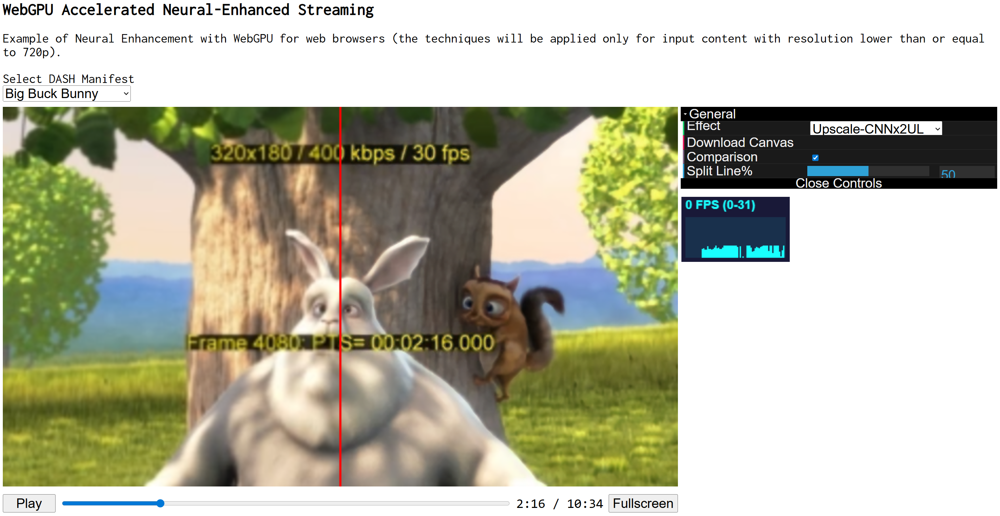

# RTNEHAS



Real-Time Neural Enhancement for HTTP Adaptive Streaming with WebGPU. 
This project integrates the `webgpu-neural` package with dashjs to run neural enhancement for HTTP Adaptive Streaming using WebGPU.

---

## 🚧 Requirements

- [Node.js](https://nodejs.org/) (version 16 or higher recommended)
- [npm](https://www.npmjs.com/) (comes with Node.js)
- [Next.js](https://nextjs.org/) (installed via `npm install`)

---

## 📦 Setup Instructions

### 1. Install and Build `webgpu-neural` Package

```bash
cd webgpu-neural
npm install
npm run build
```

### 2. Link and Set Up Main Project

```bash
cd ..
npm install
npm link webgpu-neural
npm run build
```

### 3. Start Development Server

```bash
npm run dev
```

### 4. Access the App

Once the server is running, open your browser and go to:

```bash
http://localhost:3000
```
